# Component Connection Diagrams

This document provides detailed connection instructions for all hardware components in the Glasses AI project.

## Table of Contents
- [OLED Display](#oled-display)
- [I2S Microphone](#i2s-microphone)
- [Speaker](#speaker)
- [Battery Monitoring](#battery-monitoring)
- [Push Button](#push-button)
- [Touch Sensor](#touch-sensor)
- [Battery Charging](#battery-charging)
- [Complete System Overview](#complete-system-diagram)

## OLED Display

**Component:** DFR0648 0.91" OLED White Display

**Connection Type:** I2C

**Connections:**
```
ESP32-S3 Pin   |   OLED Display Pin
---------------|------------------
3.3V           |   VCC
GND            |   GND
GPIO18 (SCL)   |   SCL
GPIO17 (SDA)   |   SDA
```

**Mermaid Diagram:**
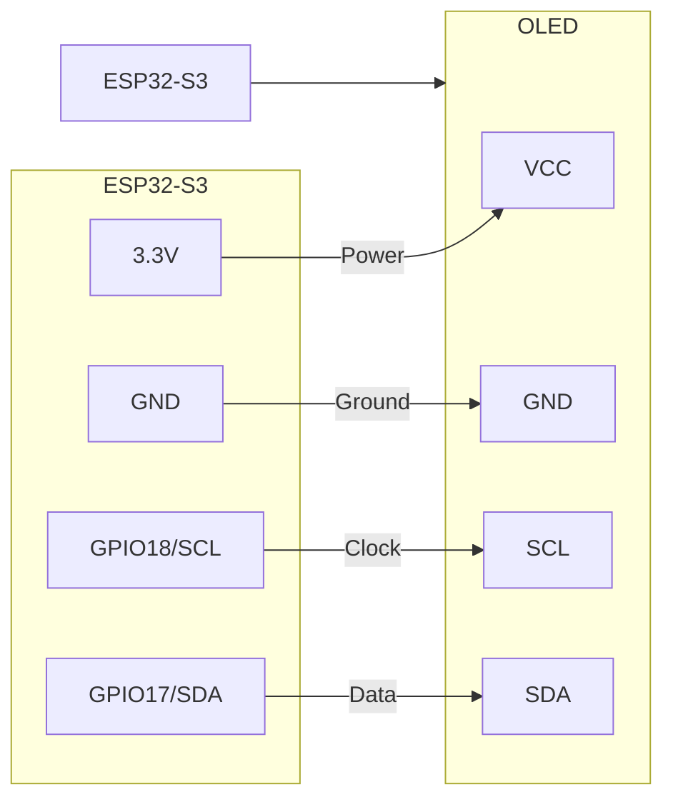

**Notes:**
- The display uses I2C communication protocol
- Default I2C address is typically 0x3C
- No additional components required for basic operation

## I2S Microphone

**Component:** ICS-43434 Digital I2S MEMS Microphone

**Connection Type:** I2S

**Connections:**
```
ESP32-S3 Pin     |   ICS-43434 Pin
-----------------|----------------
3.3V             |   VDD
GND              |   GND
GPIO2 (BCLK)     |   SCK (Clock)
GPIO1 (LRCLK)    |   WS (Word Select)
GPIO3 (DIN)      |   SD (Data)
```

**Mermaid Diagram:**
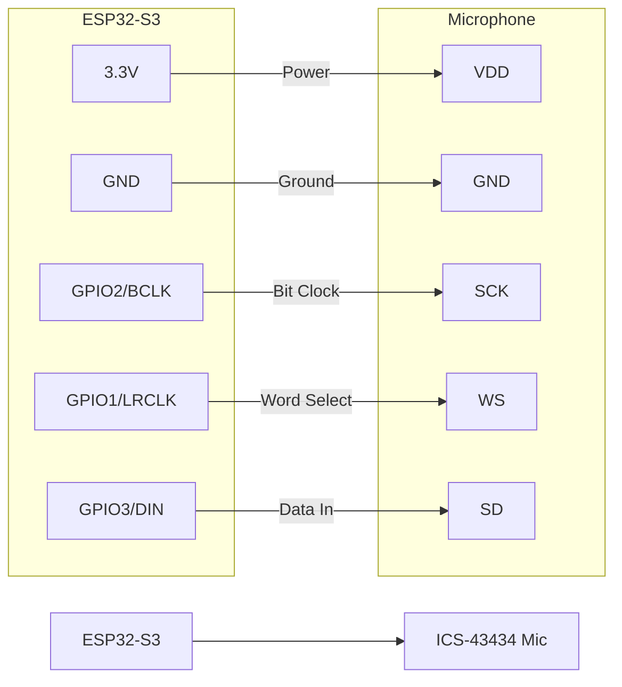

**Notes:**
- The microphone requires I2S protocol for communication
- Keep wires short to minimize noise
- No pull-up resistors required for I2S lines

## Speaker

**Component:** 8 Ohm 1W 90.1dB Speaker

**Connection Type:** Direct or via amplifier

**Simple Direct Connection:**
```
ESP32-S3 Pin     |   Speaker Pin
-----------------|----------------
GPIO5            |   + (via 10μF capacitor)
GND              |   -
```

**Mermaid Diagram (Direct Connection):**
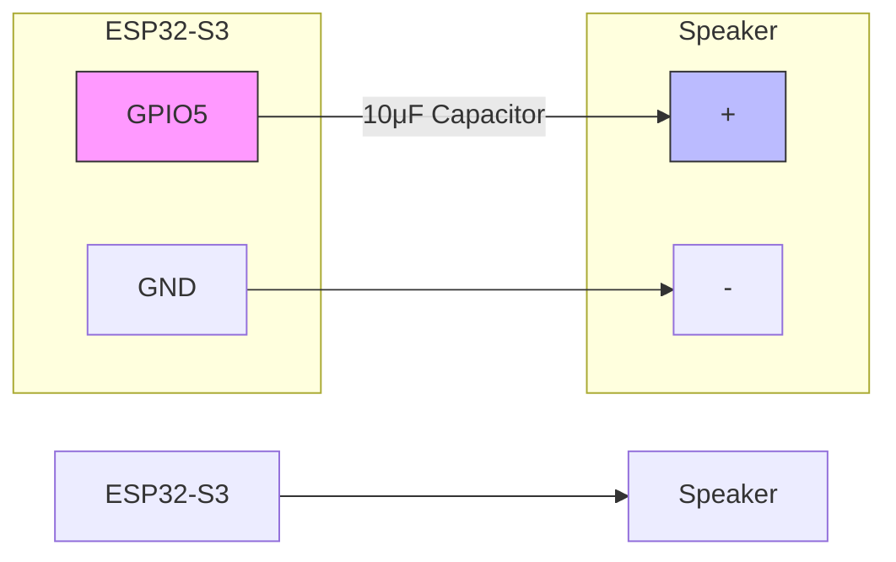

**With Amplifier:**
```
ESP32-S3 Pin     |   Amplifier       |   Speaker
-----------------|------------------|----------------
GPIO5            |   Input          |   
                 |   Output+        |   +
GND              |   GND            |   -
3.3V/5V          |   VCC            |   
```

**Mermaid Diagram (With Amplifier):**
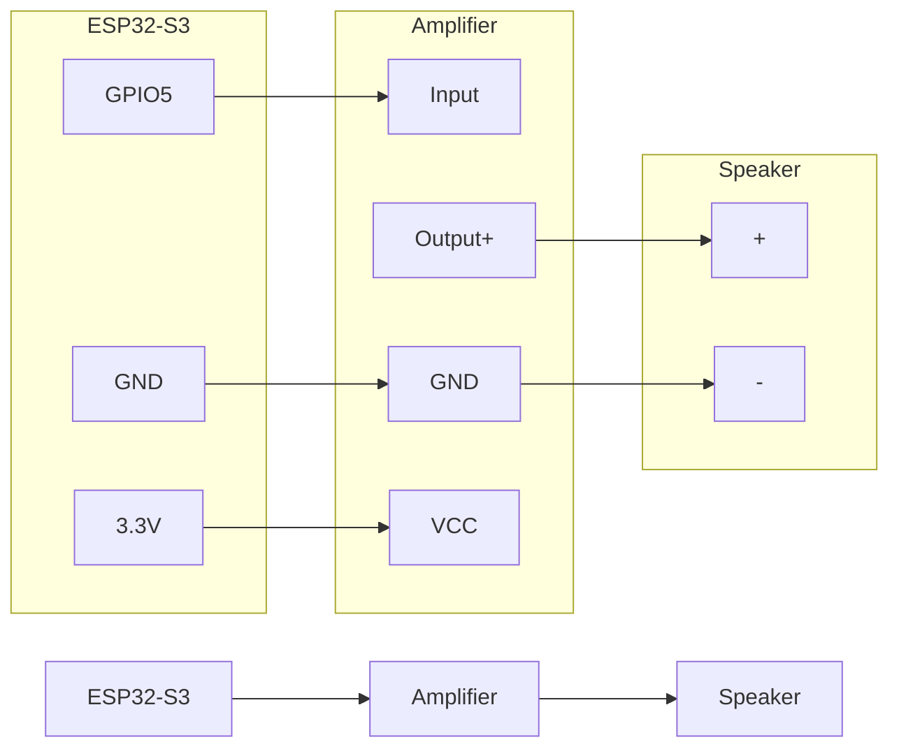

**Notes:**
- Direct connection is only suitable for simple tones
- A coupling capacitor (10μF) is needed to block DC current
- For better audio quality, use an amplifier circuit

## Battery Monitoring

**Component:** Voltage Divider (2x 10kΩ resistors per battery)

**Connection Type:** Analog

**Circuit Diagram:**
```
Battery+ ----+
              |
              R1 (10kΩ)
              |
              +------- To ESP32 ADC (GPIO34/35)
              |
              R2 (10kΩ)
              |
GND ---------+
```

**Mermaid Diagram:**
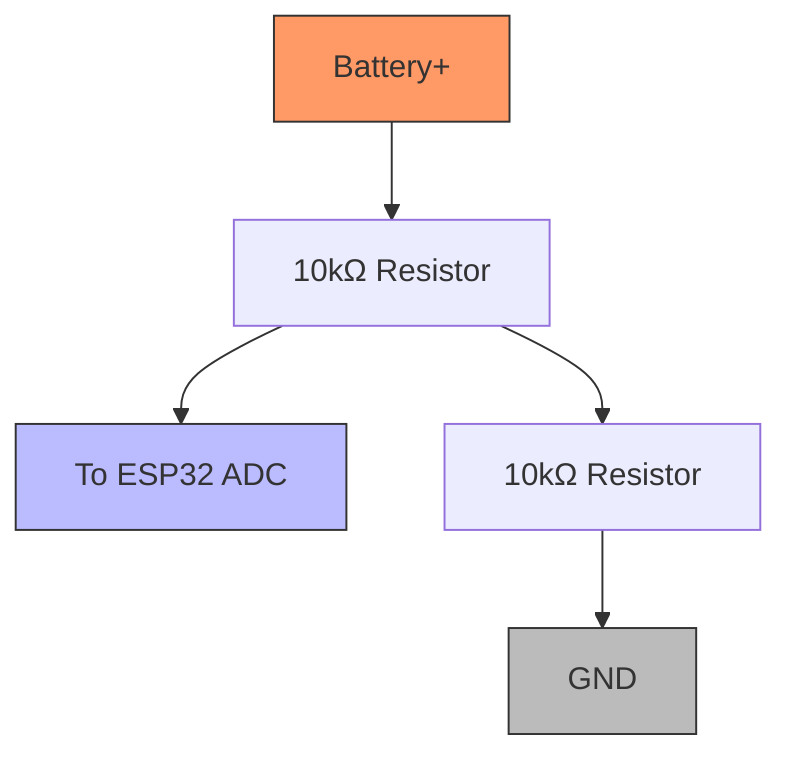

**Connections:**
```
Battery 1     |   Resistors         |   ESP32-S3 Pin
--------------|--------------------|-----------------
Battery+ (1)  |   → R1 → R2 → GND  |   R1/R2 Junction → GPIO34
Battery+ (2)  |   → R1 → R2 → GND  |   R1/R2 Junction → GPIO35
```

**Dual Battery Monitoring:**
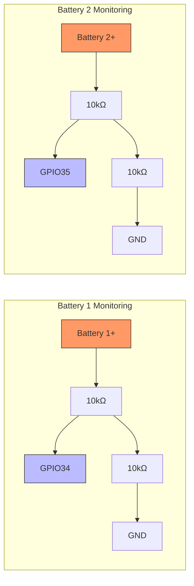

**Notes:**
- The voltage divider reduces battery voltage (3.7-4.2V) to a safe level for ESP32 ADC (0-3.3V)
- Use 1% tolerance resistors for more accurate readings
- For testing, you can use ESP32's 3.3V output instead of a real battery

## Push Button

**Component:** SPST-NO 0.1A 30V Switch (K12P BK 2 5N)

**Connection Type:** Digital Input with Pull-up

**Connections:**
```
ESP32-S3 Pin     |   Push Button
-----------------|----------------
GPIO4            |   Terminal 1
GND              |   Terminal 2
```

**Mermaid Diagram:**
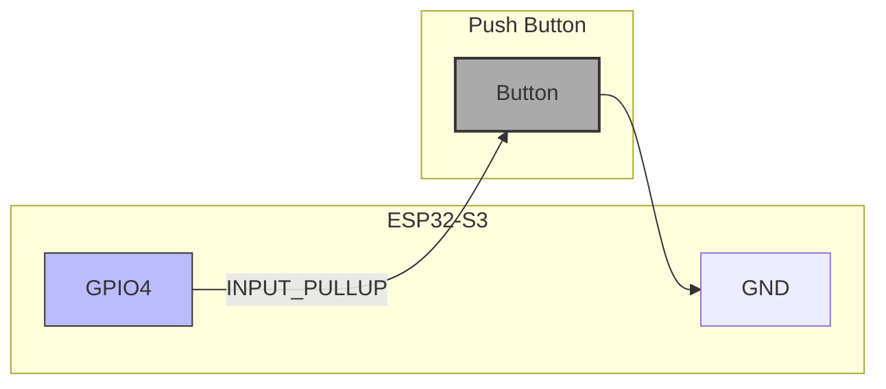

**Notes:**
- Configure GPIO4 as INPUT_PULLUP in software
- Button press will connect the pin to GND
- No external resistors needed when using internal pull-up

## Touch Sensor

**Component:** ESP32-S3 Built-in Touch Sensor

**Connection Type:** Direct

**Connections:**
```
ESP32-S3 Pin     |   External Connection
-----------------|------------------------
GPIO8 (D5)       |   Touch pad or wire (optional)
```

**Mermaid Diagram:**
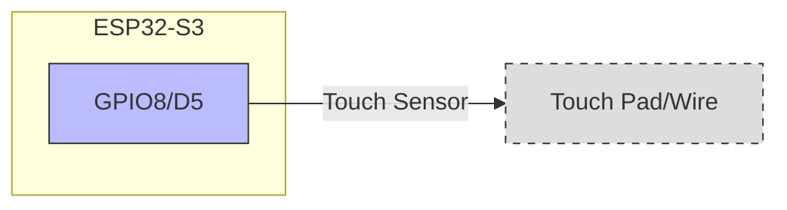

**Notes:**
- ESP32-S3 has built-in touch sensing capabilities
- Touch value increases when GPIO8 is touched
- For better sensitivity, connect a small wire or metal pad

## Battery Charging

**Component:** USB-ULIPO 470mA Battery Charger

**Connection Type:** Power

**Connections:**
```
Power Source     |   Charger       |   Battery
-----------------|----------------|----------------
USB 5V           |   USB Input    |   
                 |   BAT+         |   Battery+
                 |   BAT-         |   Battery-
```

**Mermaid Diagram:**
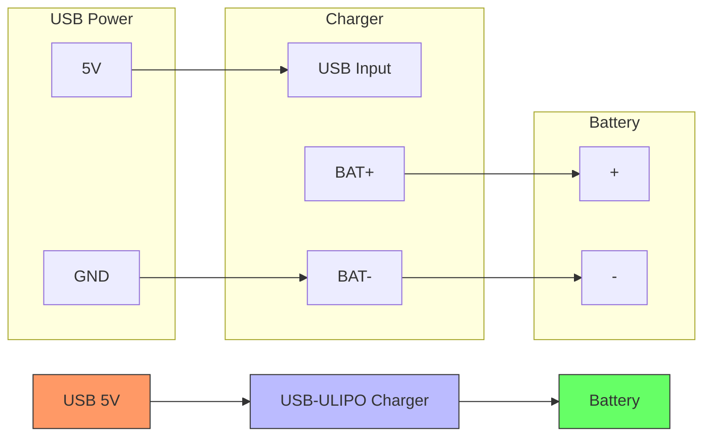

**System Integration:**
```
Charger          |   ESP32-S3     |   Other Components
-----------------|----------------|-------------------
BAT+             |   VIN/5V       |   Power distribution
BAT-             |   GND          |   Common ground
```

**Notes:**
- The charger handles charging current and voltage regulation
- Connect a power indicator LED if desired
- Always verify polarity before connecting batteries

## Complete System Diagram

For a fully assembled system, the connections should be organized as follows:

**Mermaid System Overview:**
```mermaid
graph TD
    %% Power Management
    BATT[LiPo Battery] --> CHRG[Charger]
    CHRG --> REG[3.3V Regulator]
    REG --> ESP[ESP32-S3]
    BATT --> VDIV[Voltage Divider]
    VDIV --> ESP
    
    %% User Interface
    ESP <--> OLED[OLED Display]
    ESP <-- BTN[Push Button]
    ESP <-- TOUCH[Touch Sensor]
    
    %% Audio System
    MIC[I2S Microphone] --> ESP
    ESP --> SPK[Speaker]
    
    %% Style nodes
    style BATT fill:#f96,stroke:#333
    style ESP fill:#bbf,stroke:#333
    style OLED fill:#9bf,stroke:#333
    style MIC fill:#b9f,stroke:#333
    style SPK fill:#9fb,stroke:#333
    style TOUCH fill:#fbb,stroke:#333
```

**Detailed Power Management:**
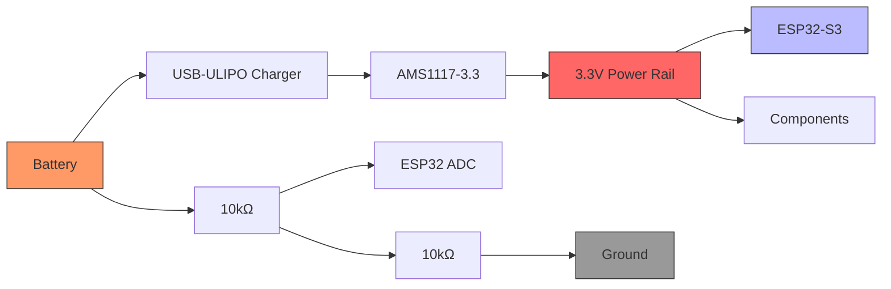

**Detailed Connections:**
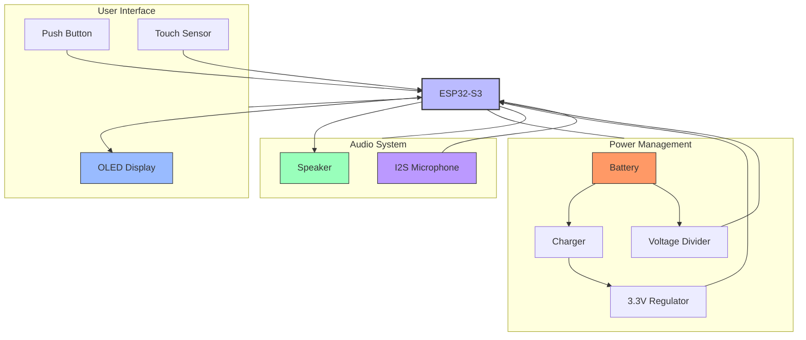

1. Power Management:
   - Battery → Charger → 3.3V Regulator → ESP32 and Components
   - Battery → Voltage Divider → ESP32 ADCs (for monitoring)

2. User Interface:
   - OLED Display ↔ ESP32 (I2C)
   - Touch Sensor → ESP32
   - Push Button → ESP32

3. Audio System:
   - I2S Microphone → ESP32
   - ESP32 → Speaker (with optional amplifier)

Always double-check connections before applying power to avoid damage to components. 